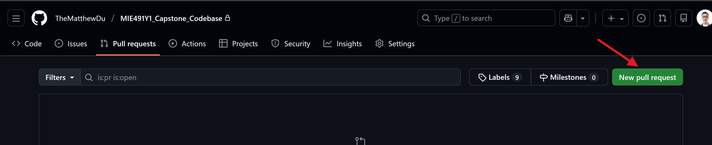

# Git Commands

## Git Pull
A **git pull** is when you get update your local copy of an already cloned repository with the most up-to-date files. To do so, run the following command
```bash
git pull origin main
```

It is always a good practice to pull frequently (i.e., every time you start to work) so you have the most up to date files

## Git Add
A **git add** tells git which files that you want it to monitor in the repository. When you create a new file, git by default will NOT automatically add that file to the list of files it keeps track of, so you need to add it for it to be tracked.

To add a file, run
``` bash
git add <filename>
```

## Git Commit
Once you are done editting a file, you need to `commit` it, which is to say, update a save state of the file to git. In other words, this is effectively a "save file" step. It is also customary to leave a helpful comment to help understand what each commit does.

To commit a file, run the following,
``` bash
git commit -m "<comment>"
```
This command will commit ALL of the files that have been added by ``git add``

## Git Push
**WARNING: SOME ONLINE TUTORIALS (I.E., CHATGPT) WILL RECCOMEND THAT YOU USE `git push origin main`. DO NOT RUN THIS. THIS WILL PUSH DIRECTLY TO MAIN. IF YOU FOLLOWED MY SETUP INSTRUCTIONS, YOU WILL AUTOMATICALLY PUSH TO YOUR OWN BRANCH. IF YOU PUSH TO MAIN, YOU WILL NEED TO DEAL WITH A VERY ANNOYED MATT. YOU HAVE BEEN WARNED :)**

Now once you are done, you want to **push** the changes to the repository so that everyone else can see it.
``` bash
git push
```
This command will add all of your commits (yes, you can have multiple commits be pushed at once). As mentioned before, this push will go to your user branch.

## Pull Requests
If you are happy with your change, we want to combine everything to the `master` branch, which will be the "good copy" of the codebase that will be used for the project. A **Pull Request** is a way of submitting a request to do something in github that others can review and leave comments on. Once everyone is happy with the pull request (often abbreviated as PR), they can approve and merge it.

To create a **Pull Request**, go to the [github repository](https://github.com/TheMatthewDu/MIE491Y1_Capstone_Codebase) and go to the `Pull Requests` tab. Press the following button.

Fill out the form, **ensuring you select the `base:main` opton**.

Submit the pull request, and then harass Matt to approve it.